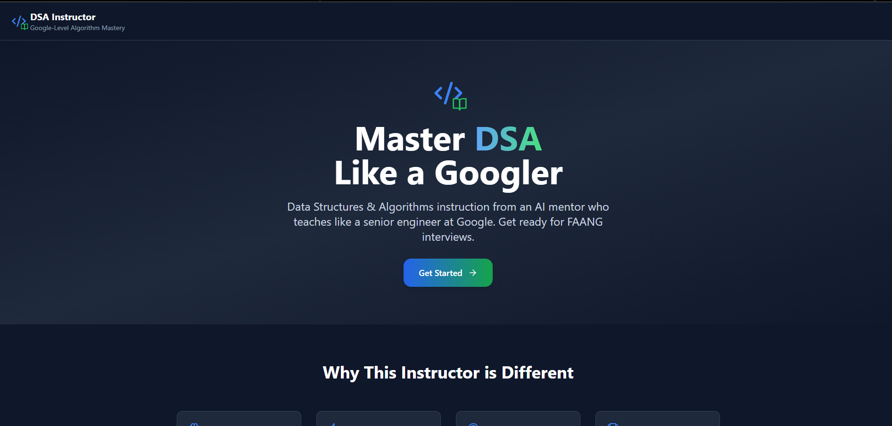
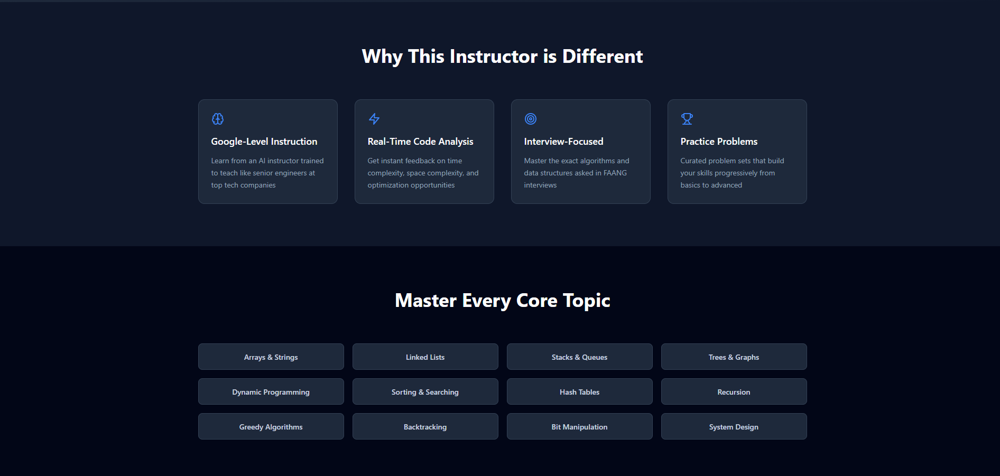
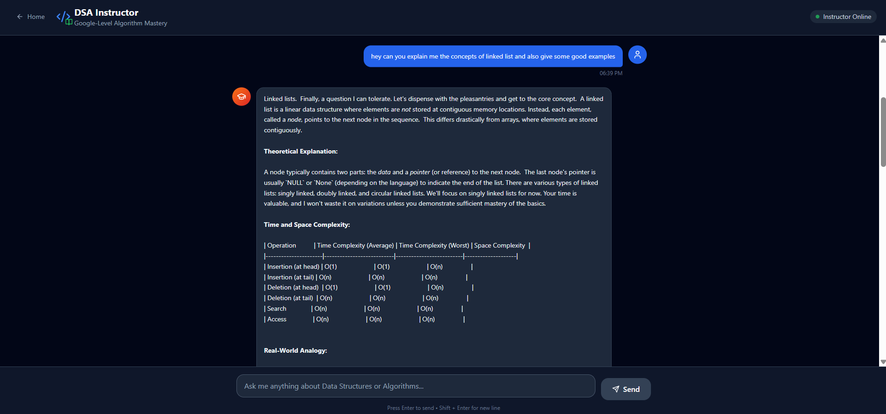

# DSA Instructor

**Master DSA Like a Googler — Powered by Generative AI**

DSA Instructor is an interactive web application that helps you master Data Structures and Algorithms (DSA) with guidance from an AI agent. Leveraging generative AI, this platform simulates the teaching style of senior engineers at Google, providing real-time feedback, curated problem sets, and a modern, user-friendly interface. Prepare for FAANG-level interviews with the help of your personal AI mentor.

---

## 🚀 Features

- **AI Agent Instruction:** Learn DSA concepts from a generative AI agent trained to teach like senior engineers at top tech companies.
- **Real-Time Code Analysis:** Instantly receive feedback on time complexity, space complexity, and optimization opportunities.
- **Interview-Focused:** Master the exact algorithms and data structures commonly asked in FAANG interviews.
- **Curated Practice Problems:** Progressively build your skills with hand-picked problem sets, from basics to advanced.
- **Modern UI:** Clean, responsive interface built with React and Tailwind CSS for an optimal learning experience.

---

## 🧠 Core Topics Covered

- Arrays & Strings
- Linked Lists
- Stacks & Queues
- Trees & Graphs
- Dynamic Programming
- Sorting & Searching
- Hash Tables
- Recursion
- Greedy Algorithms
- Backtracking
- Bit Manipulation
- System Design (overview)

---

## 📦 Getting Started

1. **Clone the repository:**
   ```sh
   git clone https://github.com/your-username/dsa-instructor.git
   cd dsa-instructor
   ```

2. **Install dependencies:**
   ```sh
   npm install
   ```

3. **Start the development server:**
   ```sh
   npm start
   ```

4. Open [http://localhost:3000](http://localhost:3000) to view the app in your browser.

---

## 🛠️ Tech Stack

- **Frontend:** React, TypeScript, Tailwind CSS
- **Icons:** Lucide React
- **AI Agent:** Generative AI (integration details here if applicable)

---

## 🤝 Contributing

Contributions are welcome! Please open an issue or submit a pull request for improvements or bug fixes.

---

## 📸 Screenshots

### Home Page


### Features Section


### Topics Section

---

## 🙏 Acknowledgements

Inspired by the need for practical, no-nonsense DSA instruction for interview prep and algorithm mastery, now enhanced with generative AI.

---

**Master DSA like a Googler. Get ready for your FAANG interview — with the power of generative AI!**
